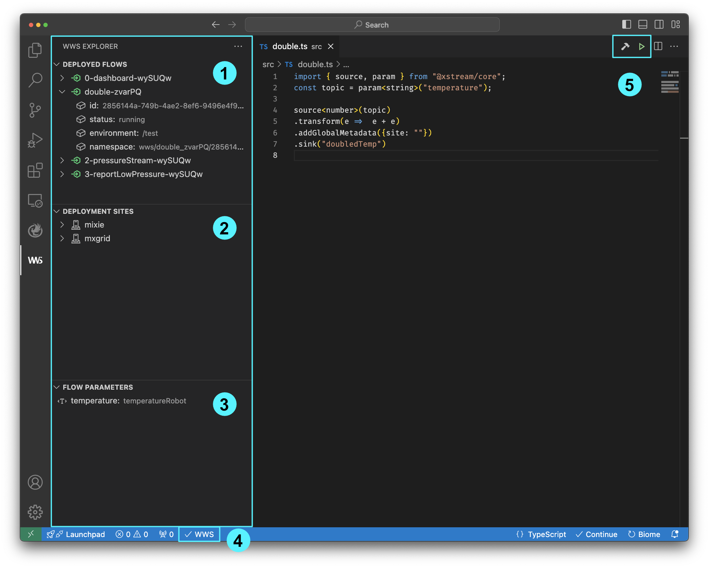

The WWS VSC extension adds a new view in the activity bar composed by four main components:

1. *Deployed Flows*: List the deployed flows. It is possible to inspect a specific flow, or execute some actions like kill, restart, revive, and redeploy.
   
2. *Deployment Sites*: List all the available deployment sites in your WWS instance.
   
3. *Flow Parameters*: List all the available parameters for the currrent open XStream file. Additionally, it is possible to add new parameters, modify and/or remove existing ones.
   
4. Status bar: Display the current status of the WWS instance. 
   
5. Toolbar: Actions available for XStreams files.
