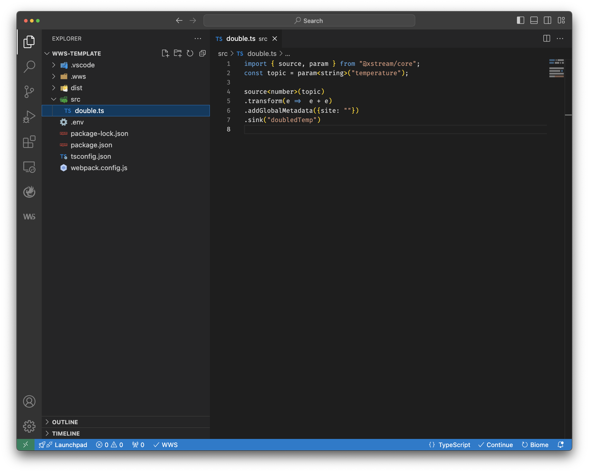
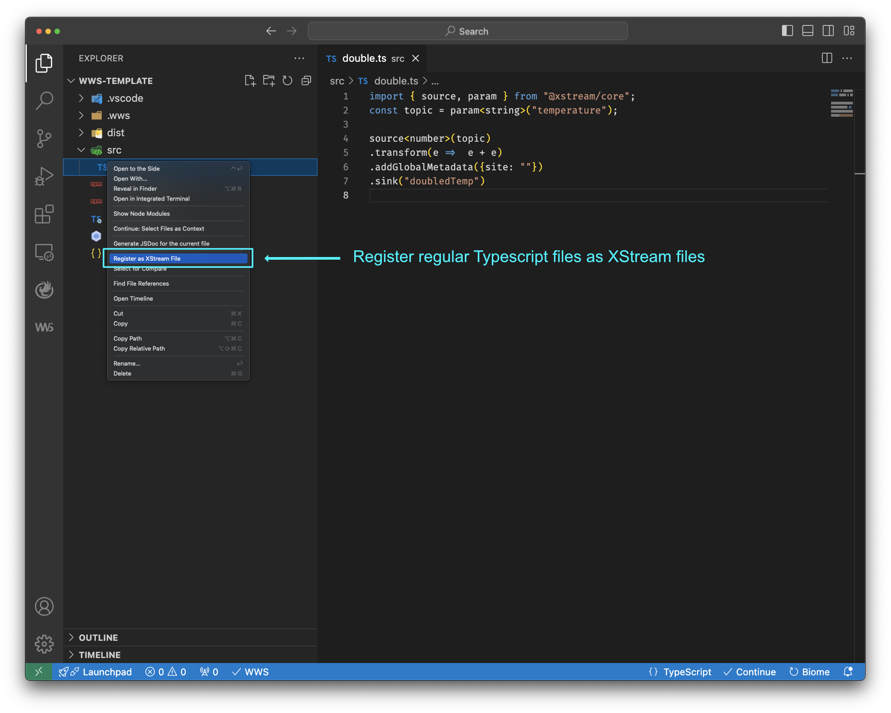
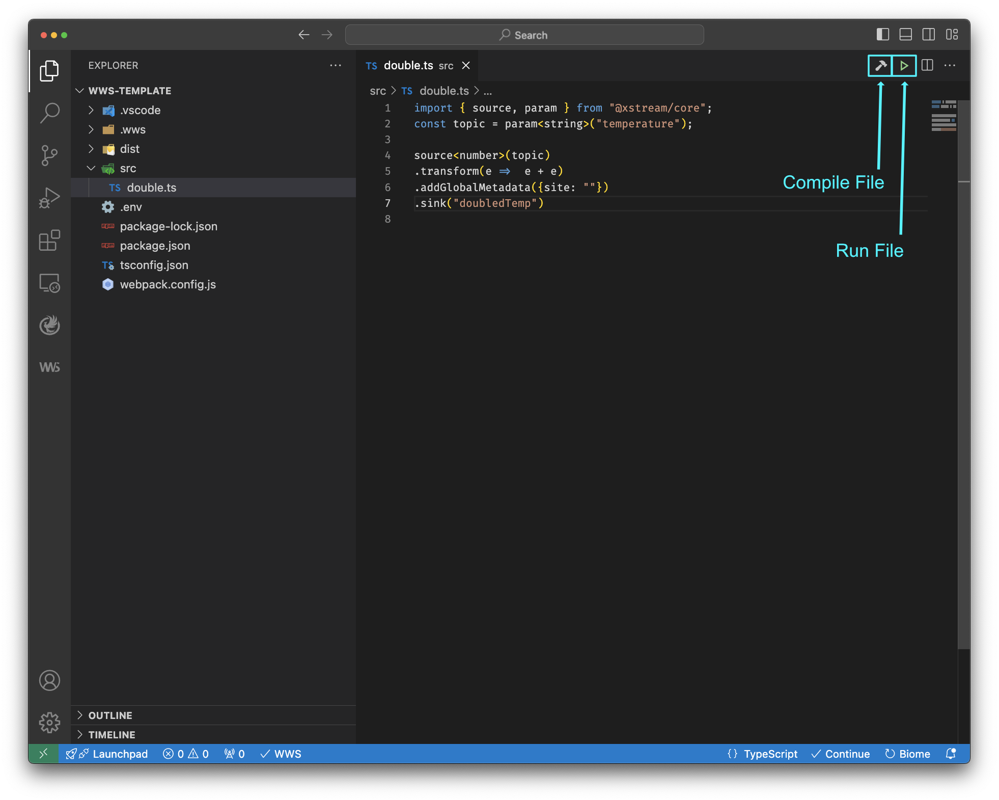
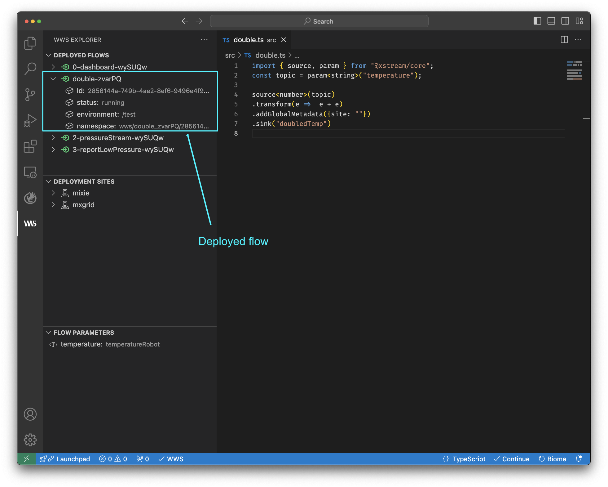

Step 1: Declare an XStream pipeline

Step 2: Set file as a XStream

Regular Typescripts files can be manually set as XStreams files by right clicking on the file and selecting `Register as XStream File` option. 

Alternative, you can name your XStream file with a `.xs.ts` extension (e.g., `double.xs.ts`) and they will be automatically detected by the WWS extension.

Step 3: Run XStream pipeline

Step 4: Inspect the new deployed flow

