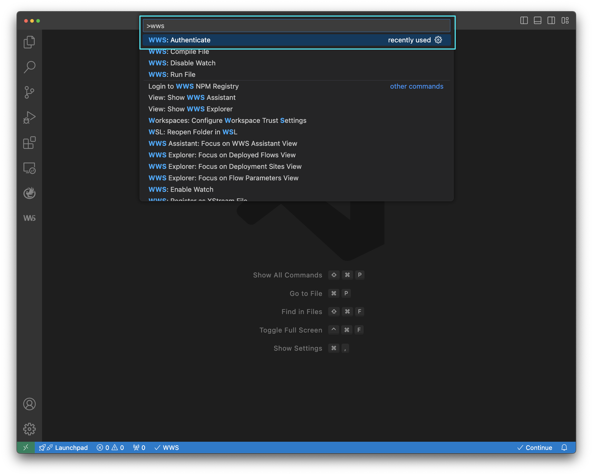
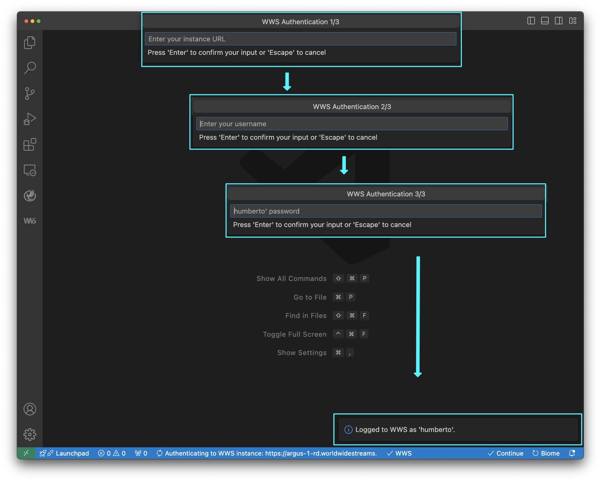
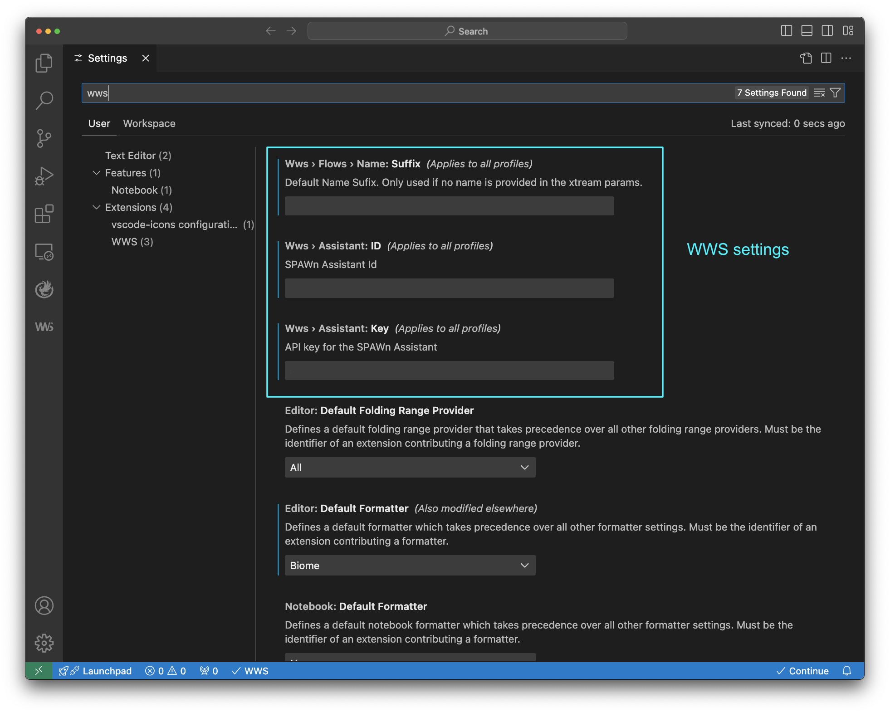

Step 1: Invoke the Authenticate Command

Run the WWS:Authenticate command via the Command Palette (`Cmd–Shift–P` on Mac 
or `Ctrl–Shift–P` on Windows/Linux). 

Step 2: Set your authentication details

Introduce your username and password to authenticate to your WWS instance.

Step 3: Set additionally settings

Open the VSCode [Settings](command:workbench.action.openSettings?%22wws%22) and and type `wws` to search for particular settings for the extension.

